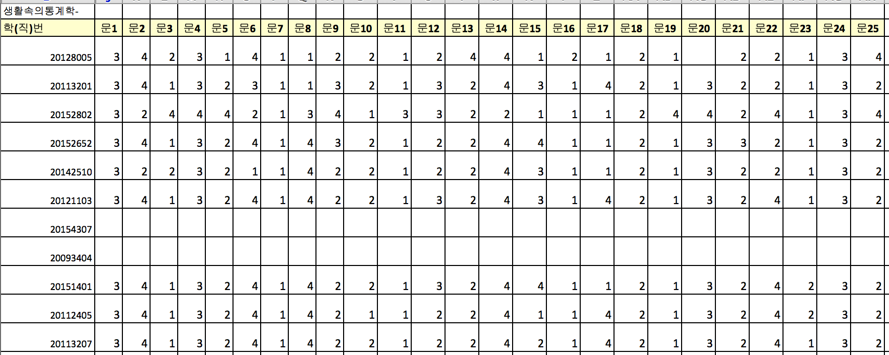

# Data 

## Excel 자료 읽어들이기 

* 코딩된 excel 자료 스크린샷



* excel 파일을 잘 읽어들이는 `xlsx` 패키지를 올려놓고, 자료구조에 맞춰 argument 설정.
    * Sheet 번호, startRow, colIndex, header 의 용도 파악. 

```{r}
library(xlsx)
options(width=180)
literacy <- read.xlsx("../data/literacy_0916.xlsx", 1, startRow = 2, colIndex = c(4, 10:34), colClasses=c("numeric", rep("character", 25)), header = TRUE)
str(literacy)
head(literacy[, -1])
```

## 문해력 점수 계산

* 정답 맞춰보기
    * 정답 읽어들이기 

```{r}
(ans <- scan("../literacy_data/literacy_ans.txt", what=""))
```

* 각 학생들의 답안과 맞춰보기 위하여 정답 매트릭스 만들기
    * 정답표를 답안과 같은 크기의 매트릭스로 반복
    
```{r}
ans.mat <- matrix(rep(ans, each = nrow(literacy)), nrow = 70)
head(ans.mat)
```

* 정답과 대조하여 TRUE/FALSE 표시 
    * 채점표라는 의미의 `literacy.marks` 로 저장
```{r}
literacy.marks <- literacy[, -1] == ans.mat
head(literacy.marks)
```

* 학생별 정답 갯수 산출
    * 4점씩 곱하면 100점 만점 기준의 점수가 됨. 
    * 조사표는 작성해서 제출했지만 빈칸이 있는 경우는 그 문항을 0점 처리, 결석의 경우는 NA처리 
    
```{r}
(literacy.score <- apply(literacy.marks, 1, sum, na.rm = TRUE) * 4)
stem(literacy.score, scale = 2)
literacy.score[literacy.score == 0] <- NA
stem(literacy.score, scale = 1)
```

* 문해력 등급 판정
    * 1수준(24점 이하), 2수준(28 ~ 48점), 3수준(52 ~ 72점), 4수준(76점 이상) 
    
```{r}
(literacy.level <- ifelse(literacy.score <= 24, "1", ifelse(literacy.score <= 48, "2", ifelse(literacy.score <= 72, "3", "4"))))
table("문해력 등급 분포" = literacy.level)
```

* 문항유형표 읽어들이기  

```{r}
(type <- scan(file = "../literacy_data/literacy_type.txt", what = ""))
(type.kr <- factor(type, levels=c("a", "b", "c"), labels=c("사실적", "추론적", "비판적")))
```

* 유형별 점수 파악
    * 왜 `literacy.marks`의 전치행렬을 사용하고 있는지 이해 필요.
    * 변수들은 사실상 각 학생을 나타내므로 변수명을 `s1, s2, ...` 등으로 바꿈.
    * 일부 문항의 응답이 NA이면 그 문항을 0점 처리, 결석이면 NA 처리. 

```{r}
literacy.type.score <- aggregate(t(literacy.marks), list("유형" = type.kr), sum, na.rm = TRUE)
data.frame("유형" = literacy.type.score[, 1], literacy.type.score[, 2:25]*4)
data.frame("유형" = literacy.type.score[, 1], literacy.type.score[, 26:48]*4)
data.frame("유형" = literacy.type.score[, 1], literacy.type.score[, 49:71]*4)
names(literacy.type.score)[-1] <- paste("s", 1:70, sep="")
literacy.type.score == 0
literacy.type.score[literacy.type.score == 0] <- NA
data.frame("유형" = literacy.type.score[, 1], literacy.type.score[, 2:25]*4)
data.frame("유형" = literacy.type.score[, 1], literacy.type.score[, 26:48]*4)
data.frame("유형" = literacy.type.score[, 1], literacy.type.score[, 49:71]*4)
```

### 문항별 정답률

* 결석한 경우와 일부 문항에 답을 내지 않은 경우를 구분하는 것이 핵심.
    * 결석한 학생들의 인덱스를 먼저 찾아내고,
    
```{r}
apply(literacy.marks, 1, function(x) all(is.na(x)))
na.all <- which(apply(literacy.marks, 1, function(x) all(is.na(x))))
```

* 정답률 계산,
    * NA를 모두 오답처리한 후, 결석한 학생들만 다시 NA로 정정.
    * TRUE의 갯수를 합하여 평균. 
    
```{r}
literacy.marks.2 <- literacy.marks
literacy.marks.2[is.na(literacy.marks.2)] <- FALSE
literacy.marks.2[na.all, ] <- NA
literacy.marks.2
options(digits=3)
(rate.by.item <- apply(literacy.marks.2, 2, mean, na.rm=TRUE)*100)
str(rate.by.item)
(rate.by.item <- as.matrix(rate.by.item, 25))
dimnames(rate.by.item) <- list("문항"= paste("문", 1:25, sep=""), "정답률"="정답률")
rate.by.item
#colnames(rate.by.item) <- "Rate(%)"
```

* 유형별 정답률 계산

```{r}
(rate.by.item.type <- data.frame("유형" = type.kr, "정답률" = rate.by.item))
dimnames(rate.by.item.type) <- list("문항"= paste("문", 1:25, sep=""), "유형과 정답률"=c("유형", "정답률"))
rate.by.item.type
```

* `replace()`를 이용하면, 

```{r}
(literacy.marks.3 <- replace(literacy.marks, is.na(literacy.marks.2), FALSE))
literacy.marks.3[na.all, ] <- NA
literacy.marks.3
```

* 어떤 문항의 정답률이 유난히 낮은가?

```{r}
rate.by.item[which(rate.by.item <= 80)]
rate.by.item[which(rate.by.item <= 70)]
rate.by.item[which(rate.by.item <= 60)]
```

## Data 정리

```{r}
save.image("literacy_201502.rda")
```
